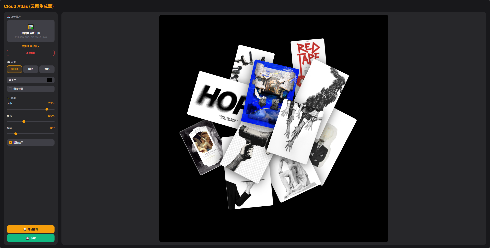

# Cloud Atlas (云图生成器)

这是一个轻量级的 HTML/JS 工具，用于批量上传图片并自动生成星云状的散布排列效果。

## ✨ 功能特点
- **批量上传**: 支持一次性上传多张图片。
- **自动布局**: 自动生成美观的散布式云图排列。
- **参数调整**: 可自定义散布范围、旋转角度、图片大小等参数。
- **背景与形状**: 支持纯色/渐变背景，以及原比例、圆形、方形裁切。
- **视觉效果**: 支持阴影效果与快速重置参数。
- **性能优化**: 超大图片会自动缩放以提升性能。
- **导出图片**: 支持将生成的云图导出为 PNG 图片。

## 🚀 使用方法

无需安装，无需服务器。

1. 直接在浏览器中打开 `index.html` 文件即可使用。

## 📌 已知限制
- 图片数量较多时可能出现重叠，当前未提供避让算法。
- 默认字体来自 Google Fonts，离线环境可能回退为系统字体。
- 外链图片可能因跨域限制无法导出。

## 📄 开源协议
[MIT](LICENSE)
